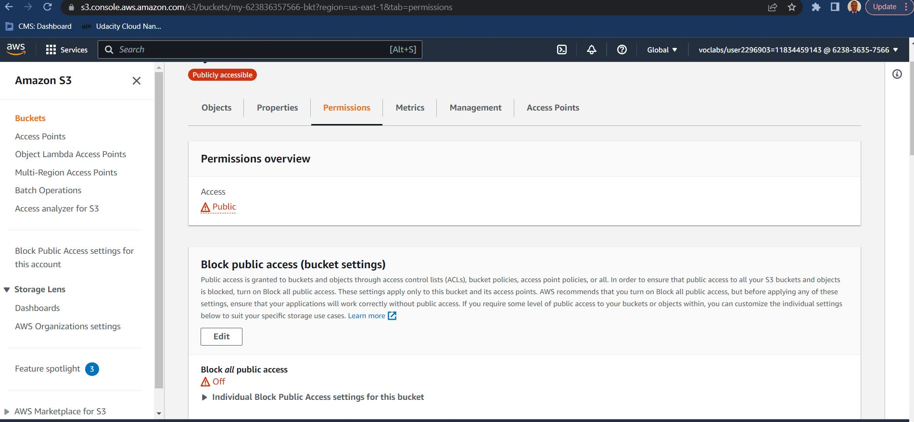

# README.md - Project-One-Rubrics

## 1. The student has created a S3 bucket.

## 2. All website files should be added to the S3 bucket.

## 3. The bucket configuration to static website hosting

## 4a. The permission access to the bucket should be configured.

## 4b. The permission access configured.

## 5. The website distributed via Cloudfront.
### https://d3lxd9td2teegd.cloudfront.net/

## 6. website-endpoint URL, Object URL
### http://my-623836357566-bkt.s3-website-us-east-1.amazonaws.com

### https://my-623836357566-bkt.s3.amazonaws.com/index.html

## 7. Cloudfront-config

## 8. Renamed-header-and-background-photo

